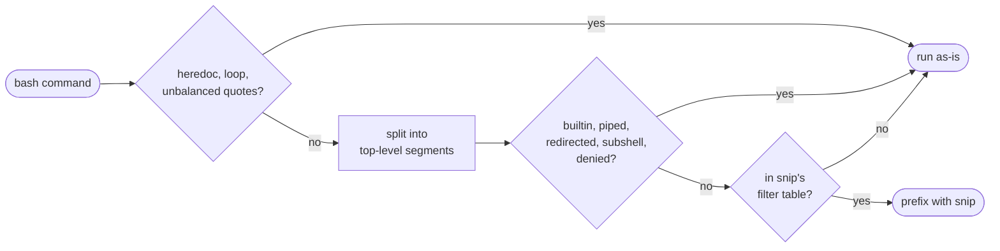

<div align="center">

# opencode-smartsnip

**Cut shell-output tokens in opencode — without breaking a single command.**

Wraps only what [snip](https://github.com/edouard-claude/snip) can filter — everything else runs byte-identical.

[](https://www.npmjs.com/package/opencode-smartsnip)
[](https://www.npmjs.com/package/opencode-smartsnip)
[](https://github.com/carson2222/opencode-smartsnip/stargazers)
[](LICENSE)

[Install](#install) · [Numbers](#numbers) · [How routing works](#how-routing-works) · [Configuration](#configuration)


</div>

```sh
cd /x && git status && cat big.json | jq '.a | .b'        # what the agent sent
cd /x && snip git status && cat big.json | jq '.a | .b'   # what actually runs
```

snip strips the noise out of git/test/build output before it reaches the model.
The hard part is knowing when wrapping is safe. Wrap everything and you get stacked
`snip snip` prefixes, broken pipes, and truncated API responses. smartsnip parses each
command and wraps only the segments that match snip's own filter table. When in doubt,
it does nothing.

## Install

```bash
brew install edouard-claude/tap/snip
```

```json
// ~/.config/opencode/opencode.json
{
  "$schema": "https://opencode.ai/config.json",
  "plugin": ["opencode-smartsnip"]
}
```

That's it. No new tools, no prompt overhead. If snip isn't on PATH the plugin
disables itself with a warning, so it's safe in a shared repo config.

<details>
<summary>Install from source instead</summary>

```bash
git clone https://github.com/carson2222/opencode-smartsnip.git
mkdir -p ~/.config/opencode/plugins
printf 'export { default } from "%s/src/index"\n' "$PWD/opencode-smartsnip" \
  > ~/.config/opencode/plugins/smartsnip.ts
```

</details>

## Numbers

One audited day of real work on a real project: ~600 bash calls, every credited output
replayed through the actual snip filters — no command re-runs.

|                          |             |
| ------------------------ | ----------- |
| `git` output             | **−70%**    |
| `pnpm` output            | **−69%**    |
| all bash output          | −11% ¹      |
| context traffic avoided  | ~1M tokens  |

¹ Conservative floor: only single-segment commands are credited; the 158 chained
commands that day counted as zero savings. Real reduction is higher.

Tool output gets re-sent on every turn that follows it, so a token saved at the source
stays saved for the rest of the session — and through compaction. That multiplier is why
an 11% cut on raw output erased ~1M tokens of cumulative context traffic in a single day.
It was a browser-automation-heavy day; run the same conservative replay on your own history:

```bash
bun scripts/measure-savings.ts --days 7        # measured, replayed through snip
bunx opencode-smartsnip discover --days 30     # estimated, plus what to filter next
```

## How routing works



The allowlist comes from snip's own filters (131 built-in, plus anything you drop in
`~/.config/snip/filters/`). `exclude_flags` and `require_flags` are honored, so
`git log --format=...` stays raw. `#nosnip` anywhere in a command skips the whole thing.

A wrong passthrough costs a few tokens. A wrong wrap breaks a command. The bias follows.

## Configuration

Optional. `~/.config/opencode/smartsnip.json`, overridable per project in
`.opencode/smartsnip.json`:

```json
{
  "deny": ["pnpm", "git diff"],
  "allow": ["curl", "mytool"],
  "toast": true,
  "stripMimicry": true
}
```

- `deny` — never wrap these (`"cmd"` or `"cmd subcommand"`)
- `allow` — force wrap-eligibility, wins over deny
- `toast` — once per session, a small TUI toast with tokens saved
- `stripMimicry` — strip stray `snip` prefixes the agent picked up from history
  before re-deciding (default on). Turn off only if you wrap commands via snip
  filter dirs that smartsnip doesn't scan

`ssh`, `curl`, `wget`, `psql`, `jq` are denied by default. snip has filters for them,
but they're blunt truncations and agents usually need that output verbatim. A truncated
API response forces a re-run, which costs more than it saves. `"allow": ["curl"]` brings
any of them back.

## Getting raw output back

snip can tee the original to a local file and append `[full output: /path.log]` to the
filtered result. The agent already has a Read tool, so nothing is ever lost. In
`~/.config/snip/config.toml`:

```toml
[tee]
mode = "always"
```

`smartsnip doctor` checks this, along with the rest of your setup.

One line in `AGENTS.md` makes agents use it well:

```
Shell output is auto-compressed. Append `#nosnip` to a command if you need raw output.
If you see `[full output: <path>]`, Read that file instead of re-running.
```

## Finding what to filter next

```bash
bunx opencode-smartsnip discover --days 30
```

Replays your real opencode bash history (read-only, local) through the router:

```
2106 commands, ~893.5k tokens of raw output

FILTERED by snip:
  git        418 calls   182.4k est. tokens
  pnpm       184 calls   164.7k est. tokens

NO FILTER (biggest missed savings first):
  python3     49 calls    73.2k est. tokens
  agent-browser 83 calls  33.2k est. tokens
```

A snip filter is ~10 lines of YAML. `bunx opencode-smartsnip install-command` adds a
`/snip-filter` command that writes and tests one for you — say `/snip-filter python3`
and the new filter is picked up automatically.

## Why not wrap everything?

That's what [opencode-snip](https://github.com/VincentHardouin/opencode-snip) does, and
it's where this project started. The failure modes are all known issues there:

| | wrap everything | smartsnip |
|---|---|---|
| `snip: no filter for "X"` noise | [#16](https://github.com/VincentHardouin/opencode-snip/issues/16) | never from routing ¹ |
| `snip snip` stacking | [#15](https://github.com/VincentHardouin/opencode-snip/issues/15) | normalized away per segment |
| `jq '.a \| .b'` quoted pipes | [#8](https://github.com/VincentHardouin/opencode-snip/issues/8) | quote-aware parser |
| `VAR=$(cmd)` corruption | [#22](https://github.com/VincentHardouin/opencode-snip/issues/22) | detected, passthrough |
| heredocs | [#6](https://github.com/VincentHardouin/opencode-snip/issues/6) | detected, passthrough |
| permission rules see rewritten commands | [#7](https://github.com/VincentHardouin/opencode-snip/issues/7) | only filterable commands change |

The router is validated against 23k+ real bash commands from actual opencode sessions —
65% of calls still get filtered, with none of the breakage.

¹ One feedback loop is unavoidable at this layer: opencode stores the *rewritten*
command, so agents start typing `snip` themselves — sometimes on things snip can't
filter (`snip sed`, `… | snip python3`). smartsnip strips those stray prefixes back off
before running (`stripMimicry`, on by default), which also collapses any stacking. For
the rare command too complex to parse, set `quiet_no_filter = true` under `[display]` in
`~/.config/snip/config.toml` as a backstop — `smartsnip doctor` checks for it.

## Development

```bash
bun install
bun test                  # includes a replay of 656 sanitized real-world commands
bun run typecheck
bun run generate:filters  # re-sync allowlist from upstream snip filters
bun run measure --days 7  # replay your real bash history through snip (the Numbers)
```

## License

MIT
